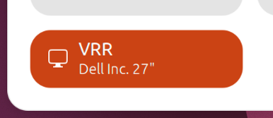

# VRR Toggle

A GNOME Shell extension that adds a global Variable Refresh Rate (VRR) toggle to the Quick Settings menu.



Being able to quickly toggle VRR is handy when running certain apps and games, because of NVIDIA bug 5374195, which causes flickering when Low Framerate Compensation (LFC) kicks in.

## Manual Installation

### 1. Clone the repository to the extension directory
```bash
git clone https://github.com/idzikovsky/vrr-toggle.git ~/.local/share/gnome-shell/extensions/vrr-toggle@idzikovsky.github.io
```

### 2. Compile schemas
```bash
glib-compile-schemas ~/.local/share/gnome-shell/extensions/vrr-toggle@idzikovsky.github.io/schemas/
```

### 3. Enable the extension
Log out and back in, then run:
```bash
gnome-extensions enable vrr-toggle@idzikovsky.github.io
```

## Usage
Click the VRR tile in Quick Settings to toggle VRR on or off.

You can disable the "Keep these display settings?" confirmation dialog that appears when you toggle VRR. Open the extension preferences with:
```bash
gnome-extensions prefs vrr-toggle@idzikovsky.github.io
```

## Acknowledgements
Big thanks to the [Postnozet/vrr-blocker](https://github.com/Postnozet/vrr-blocker) project.  
It's a great extension, but it doesn't suit my case: I run some games through Gamescope, so they report Gamescope's `WM_CLASS` instead of their own.
